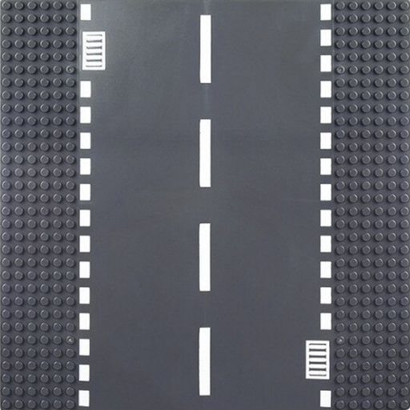
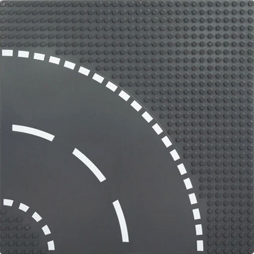
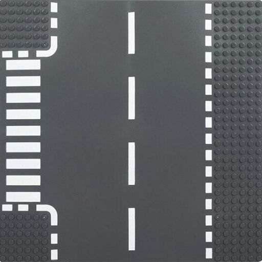
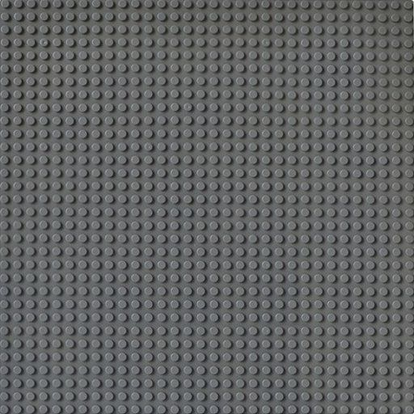
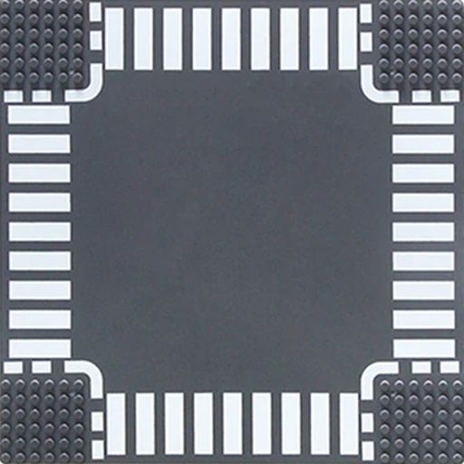
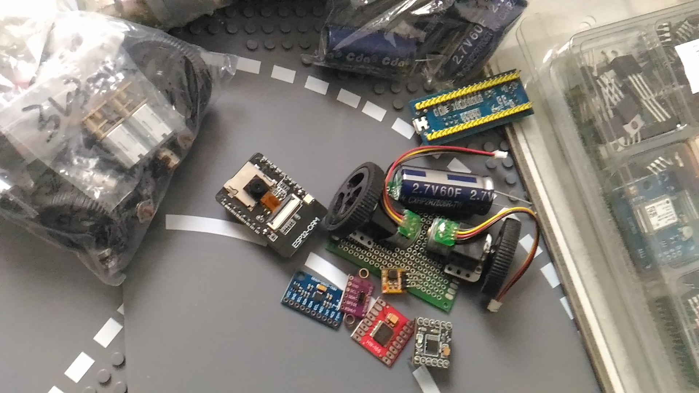

# RoadTilesRecognition
Projet de simulation de circulation de petits véhicules autonomes sur une route faite de tiles.

## Tileset

  
  
  
  
  

## Software Local
- Reconnaissance de Tiles basique (en vue de face)
- Reconnaissance Multiple (R-CNN)
- Moteur 3D basique pour rotation/translation des tiles (data augmentation)
- La position de l'objet doit être un quad (pas une bbox) 

## Software Robot
- Module de gestion tileMap basique
- Moteur physique basique
- Génération d'une tileMap à partir de son module de détection de tiles
- Prédiction sur la hauteur/orientation (à tester)

## Hardware Robot
- Le robot est piloté par un ESP32-CAM
- Le chassis est un simple PCB 60x40mm
- Le robot possède deux roues et doit donc se maintenir en équilibre (MPU9250)
- 2 moteurs stepper + drivers (DRV8833/L298N)
- L'alimentation se fait par un super-cap 60F + mini convertisseur boost (DD0405MA)

  
